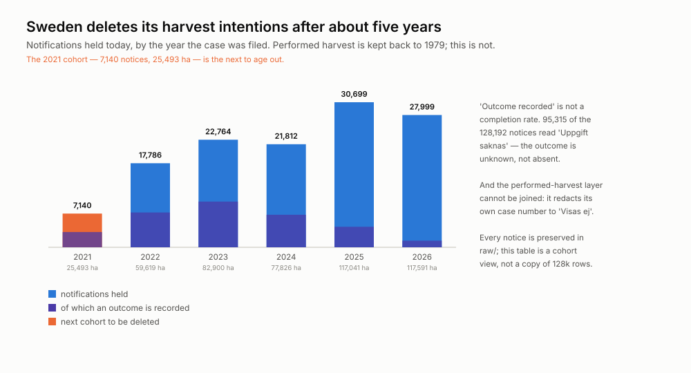
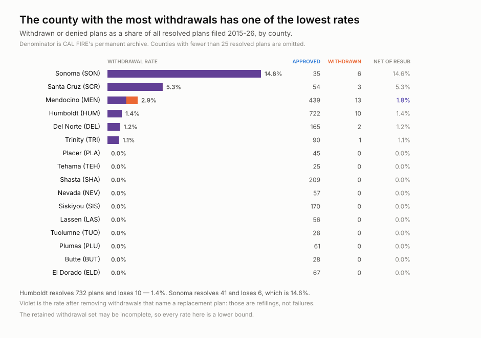

<h1 align="center">wss-forest-harvest</h1>

  <strong>Forest harvest pipelines, kept where the regulator deletes them</strong>

  
  
  
  

  fleet: <a href="https://github.com/neldivad/wss-engine">engine</a> · <a href="https://github.com/neldivad/wss-hugging-face">hugging face</a> · <a href="https://github.com/neldivad/wss-openrouter">openrouter</a> · <a href="https://github.com/neldivad/wss-cloud-footprint">cloud footprint</a> · <a href="https://github.com/neldivad/wss-mining-pipeline">mining</a> · <strong>forest</strong>

**Two forest regulators, two ways of deleting the same thing.**

| | California (CAL FIRE) | Sweden (Skogsstyrelsen) |
| --- | --- | --- |
| kept for ever | 76,967 approved plans, from 2011 | **1,381,643 performed harvests, from 1979** |
| discarded | withdrawn plans leave no trace in the permanent record | **notifications age out after ~5 years** |
| held today | 217 plans | 128,200 notifications, 2021–2026 only |
| next to vanish | unknown — retained *for now* | **the 2021 cohort: 7,140 notices, 25,493 ha** |

In California, denominators flip the answer: Mendocino has the most withdrawals
at a **2.9%** rate, Sonoma a sixth as many at **14.6%**. Roughly 97 in 100
filed plans reach approval.

## Should you fork this?

**Yes** for a dated record of harvest intentions before a regulator erases
them, or as a worked example of mapping polygons with no GIS stack at all.

**No** if you need any of these — none will ever exist here:

| | |
| --- | --- |
| Volume harvested, or what was actually cut | proposal stage only |
| A completion rate for Sweden | 95,315 of 128,192 notices read *"Uppgift saknas"* — outcome unknown, not absent |
| Intention joined to outcome | Sweden redacts its case number to *"Visas ej"* |
| Landowner names | not in either captured layer, deliberately |
| Most of the California analysis | it needs **no archive** — six of twelve questions come from one download |
| History before September 2026 | nobody kept it |

**Cost:** two Actions jobs, no key, no account. California weekly (14 GETs,
2.2 MB); Sweden monthly (226 GETs, 31 MB).

## More

- [Research questions](docs/research-questions.md) — all twelve, which six need no archive, what each chart answers
- [How it works](docs/design.md) — partitioning, geometry, byte-stability, running it locally
- [All charts](examples/charts/) · [Sources and licences](SOURCES.md)

Code MIT ([LICENSE](LICENSE)); data CC-BY-4.0 ([LICENSE-DATA](LICENSE-DATA)),
citation in [CITATION.cff](CITATION.cff). Captured content remains subject to
each publisher's terms.

Topics: `git-scraping` · `open-data` · `point-in-time-data` · `forestry` · `gis`
