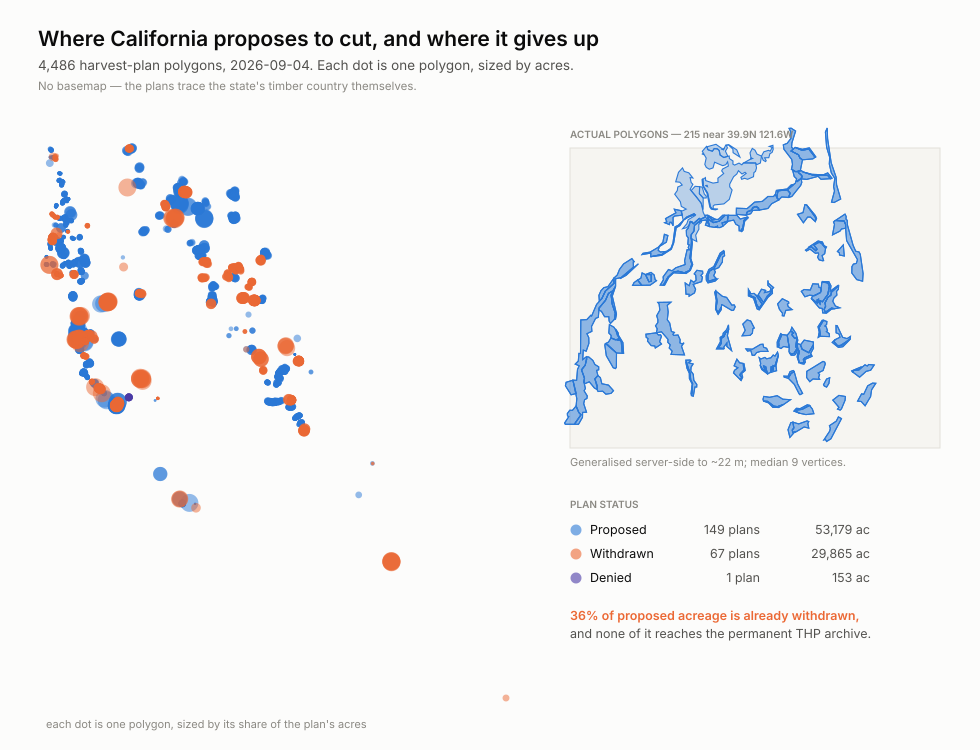
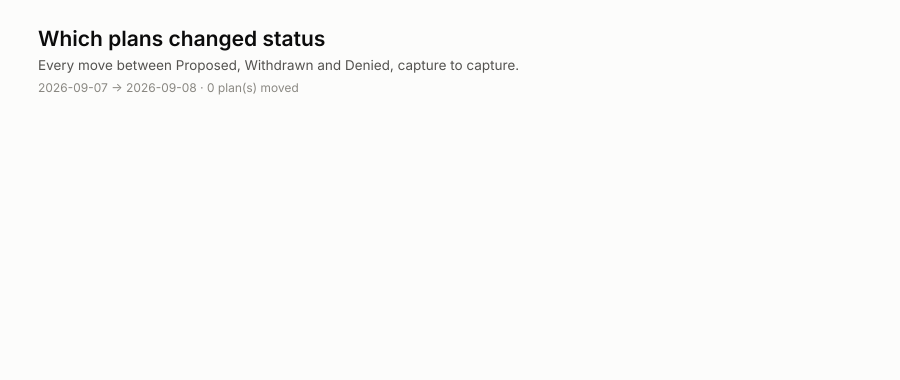

<h1 align="center">wss-forest-harvest</h1>

<p align="center">
  <strong>Which California timber harvest plans are withdrawn before anyone approves them</strong>
</p>

<div align="center">

  <a href="https://github.com/neldivad/wss-forest-harvest/actions/workflows/capture-weekly.yml"></a>
  <a href="https://github.com/neldivad/wss-forest-harvest/commits"></a>
  <a href="https://github.com/neldivad/wss-forest-harvest/blob/main/LICENSE"></a>
  <a href="https://github.com/neldivad/wss-forest-harvest"></a>

</div>

<p align="center">
  <sub>fleet: <a href="https://github.com/neldivad/wss-engine">engine</a> · <a href="https://github.com/neldivad/wss-hugging-face">hugging face</a> · <a href="https://github.com/neldivad/wss-openrouter">openrouter</a> · <a href="https://github.com/neldivad/wss-cloud-footprint">cloud footprint</a> · <a href="https://github.com/neldivad/wss-mining-pipeline">mining</a> · <strong>forest</strong></sub>
</p>

CAL FIRE publishes every proposed timber harvest plan with a status of
**Proposed, Withdrawn or Denied**. It has no `timeInfo`, no historic-moment
support and no dated snapshots.

The permanent record does not keep the failures. CAL FIRE's archive holds
76,967 approved and completed plans back to 2011 — but of **20 withdrawn plans
sampled by `HD_NUM`, none appeared in it.** A third of proposed acreage is
withdrawn, and that acreage is erased rather than archived.

At the first capture (4 September 2026):

| status | plans | acres |
| --- | --- | --- |
| Proposed | 149 | 53,179 |
| **Withdrawn** | **67** | **29,865** |
| Denied | 1 | 153 |

## What it shows today



## What it cannot show yet



A withdrawal is deleted from the public record; the archive is the only place
it survives. That chart fills itself in at the second capture — re-run
[`examples/visualize.py`](examples/visualize.py).

## Should you fork this?

**Yes, if** you want a dated record of which harvest proposals die before
approval — forest policy, watershed and habitat work, or a worked example of
mapping polygons with no GIS stack at all.

**No, if** you need:

| you need | status |
| --- | --- |
| Why a plan was withdrawn | **never** — there is no reason field |
| Volume harvested, or what was actually cut | **never** — this is the proposal stage |
| Approved and completed plans | already archived by CAL FIRE — cite their THP layer |
| Landowner or timber-owner names | not in this layer, deliberately |
| Anywhere outside California | one state, one regulator |
| History before September 2026 | impossible — nobody kept it |

**Cost:** one Actions job a week, 14 polite GETs against one state host, about
**2.2 MB raw and 0.2 MB derived per capture**. No key, no account.

## How it works

One observation per **plan**, not per polygon. The service returns one row per
polygon and a plan carries many — 4,486 polygons were 217 plans at first
capture, so anything counted per row is out by roughly twenty.

**Geometry is requested but never enters the observation table.** Endpoints ask
for `outSR=4326` and `maxAllowableOffset=0.0002`, which generalises polygons
server-side to about 22 m — 1.78 MB down to 291 KB per partition with a median
of 9 vertices and *no* polygon lost. Shapes live in `raw/`; status history
lives in `derived/`; the chart script joins them.

**No GIS dependency, anywhere.** Because the service returns WGS84 already, a
map is lon/lat → x/y and an SVG `<path>`. No shapefile reader, no reprojection,
no basemap package, no plotting library — the whole fleet stays stdlib-only,
and a timelapse is just one panel per `observed_at`.

**`observed_at` is pinned to the capture date.** This source publishes no "as
of" stamp, so derive would otherwise date each observation by the second its
partition was fetched, and one capture would arrive as fourteen snapshots
seconds apart. The parser reads the date from the raw filename instead, so a
run is one snapshot.

**Completeness is asserted, not assumed.** The service caps a response at 2,000
features and says so in the payload while still returning HTTP 200. Partitions
are `HD_NUM` string ranges — a business key, not a surrogate id — sized so the
largest holds 1,088. A gate fails the capture if any response reports
truncation.

## How it runs

Capture runs Mondays 22:10 UTC, derive the next day, health daily — powered
by the [wss-engine](https://github.com/neldivad/wss-engine), pinned to one
version. No workflow ever names a source: capture shards whatever
`registry/` marks active, so infrastructure never changes when sources do.
The bot commits **data only** — it never changes code; the one config it may
touch is flipping a repeatedly-failing source to `auto_disabled`, with an
issue explaining why.

## Adding a source

1. Add `registry/<source_id>.yml` (copy the example entry), `status: paused`.
2. Add a parser in `parsers/` if the payload shape is new.
3. `wss doctor <source_id>` — **read the raw response**.
4. Flip to `status: active`, add a Coverage row, commit.

Nothing else. No workflow edits, ever.

## Run it locally

```bash
python -m venv .venv && . .venv/bin/activate
pip install -r requirements.txt
export WSS_CONTACT="you@example.com"   # identifies you to publishers

wss validate
wss doctor <source_id>
wss capture --cadence weekly
wss derive --parsers parsers.<module>
wss health --dry-run
```

## Going live

1. Push this repo **and the engine repo** under the same GitHub owner
   (`neldivad`) — the workflows install the engine from
   `github.com/neldivad/wss` at the pinned tag.
2. Set the repo secret **`WSS_CONTACT`** — capture refuses to run
   without it.
3. Run `capture-weekly` once by hand (Actions → capture-weekly → Run
   workflow), confirm the bot's data commit lands, then let the cron take
   over.

## Licences

Two separate files, on purpose: code is MIT ([LICENSE](LICENSE)); data
(`raw/`, `manifest/`, `derived/`) is CC-BY-4.0
([LICENSE-DATA](LICENSE-DATA)), citation in [CITATION.cff](CITATION.cff).
Captured content remains subject to the publisher's own terms.

Topics: `git-scraping` · `open-data` · `point-in-time-data` · `dataset`
