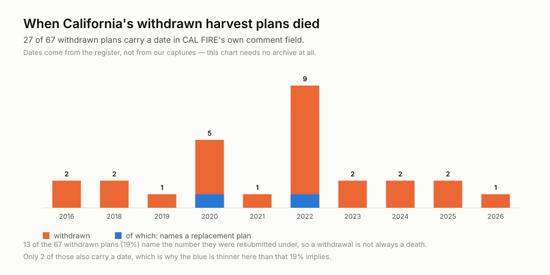
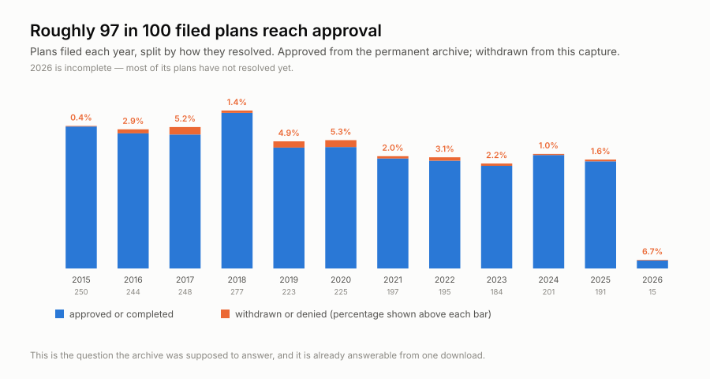
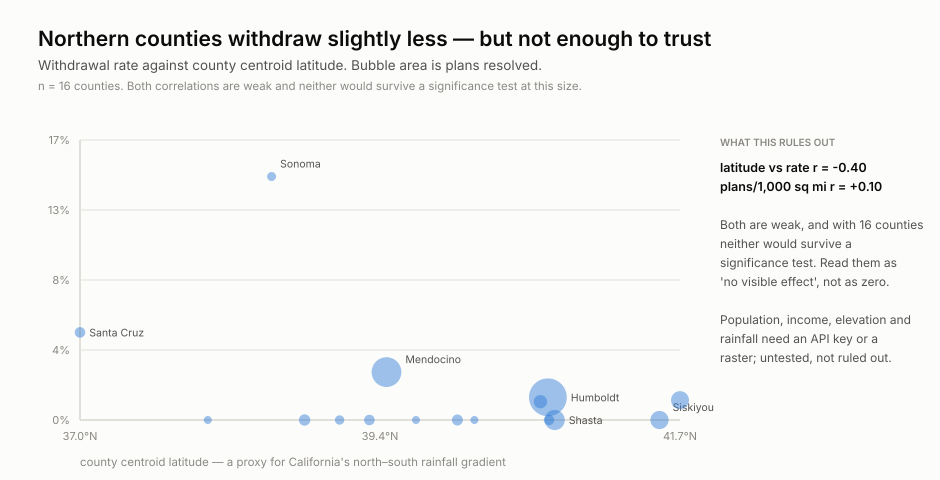
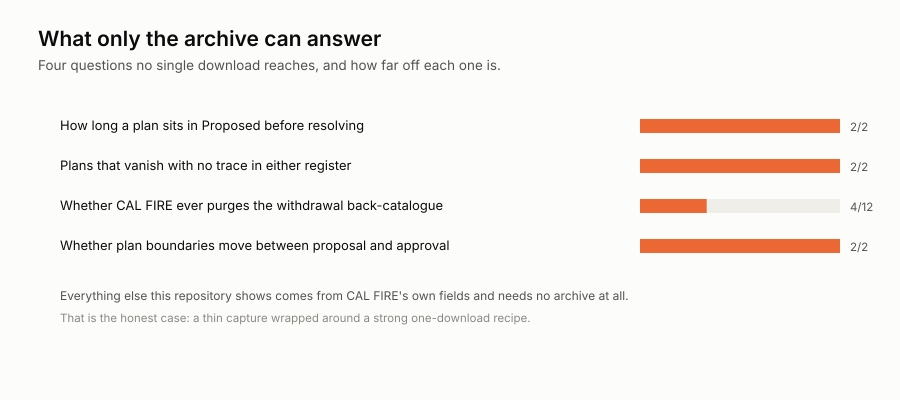

<h1 align="center">wss-forest-harvest</h1>

<p align="center">
  <strong>Forest harvest pipelines, kept where the regulator deletes them</strong>
</p>

<div align="center">

  <a href="https://github.com/neldivad/wss-forest-harvest/actions/workflows/capture-weekly.yml"></a>
  <a href="https://github.com/neldivad/wss-forest-harvest/commits"></a>
  <a href="https://github.com/neldivad/wss-forest-harvest/blob/main/LICENSE"></a>
  <a href="https://github.com/neldivad/wss-forest-harvest"></a>

</div>

<p align="center">
  <sub>fleet: <a href="https://github.com/neldivad/wss-engine">engine</a> · <a href="https://github.com/neldivad/wss-hugging-face">hugging face</a> · <a href="https://github.com/neldivad/wss-openrouter">openrouter</a> · <a href="https://github.com/neldivad/wss-cloud-footprint">cloud footprint</a> · <a href="https://github.com/neldivad/wss-mining-pipeline">mining</a> · <strong>forest</strong></sub>
</p>

Two regulators, two ways of discarding the same thing.

| | California (CAL FIRE) | Sweden (Skogsstyrelsen) |
| --- | --- | --- |
| what is kept for ever | 76,967 approved and completed plans, from 2011 | **1,381,643 performed harvests, from 1979** |
| what is discarded | plans withdrawn before approval leave no trace in the permanent record | **notifications age out on a ~5-year window** |
| held today | 217 plans | **128,192 notifications, 2021–2026 only** |
| next to vanish | unknown — the back-catalogue is retained *for now* | **the 2021 cohort: 7,140 notices, 25,493 ha** |

Sweden is the cleaner case. California's purge is speculative; Sweden's window
is visible in the data — notifications stop at 2021 while outcomes reach 1979.

## California

CAL FIRE publishes every proposed timber harvest plan with a status of
**Proposed, Withdrawn or Denied**, and no `timeInfo`, historic-moment support
or dated snapshots.

At the first capture (4 September 2026) the layer held **217 plans** across
4,486 polygons: 149 Proposed, 67 Withdrawn, 1 Denied.

**Read that split carefully — it is two populations.** The Proposed plans are
almost all current (141 of 149 filed in 2025–26). The Withdrawn ones are a
*retained back-catalogue* reaching filing year 2015. Dividing one by the other
gives a withdrawal "rate" that means nothing, and an earlier version of this
README did exactly that.

### What one download already shows

None of the charts in this section need the archive.




CAL FIRE's own `COMMENTS` field dates 44 of the 67 withdrawals, gives a reason
on many (*"Withdrawn before approval 10/20/2020 due to Castle Fire"*) and names
a replacement plan on 13 — so a withdrawal is often a refiling, not a death.


**Raw counts mislead.** Mendocino has the most withdrawals, at a 2.9% rate;
Sonoma has a sixth as many at **14.6%**. The denominator is CAL FIRE's
permanent archive, joined on `HD_NUM`. Violet shows the rate after removing
refilings.





Latitude and harvest intensity both correlate weakly and negatively with the
withdrawal rate (**r = −0.40** and **−0.32**), but with 16 counties neither
survives a significance test. Population, income, elevation and rainfall are
untested rather than ruled out — the Census API needs a key.

## Sweden


Two things this source **cannot** do, both tested rather than assumed:

- **No join to outcomes.** The performed-harvest layer redacts its own case
  number to `Visas ej` — "not shown". Only a spatial join would connect
  intention to outcome, and that is real GIS work.
- **No completion rate.** `AvvHa` is populated on 32,815 of 128,192 notices;
  the other 95,315 read `Uppgift saknas` — the outcome is *unknown*, not
  absent. Reading 42% as a completion rate would be wrong.

What remains is worth keeping on its own: notification volume, area, type,
county and municipality, for cohorts that Sweden is about to delete.

**One engineering catch, recorded because it silently breaks archives.** The
service returns rows in a different order on every request — three identical
fetches gave three different hashes at an identical byte count. Without
`orderByFields` every capture looks changed, dedup never fires, and the archive
grows without bound. CAL FIRE's hosted service happens to be stable; this one
is not. See [casing a site](../wss-engine/docs/casing-a-site.md), question 5b.

## What only repeated capture can answer



Four questions, and the strongest is speculative: the withdrawal back-catalogue
is retained *today* and nothing guarantees it will be. If CAL FIRE ever purges
it, this becomes the only record. The first months of capture are the test.

[Research questions](docs/research-questions.md) sets out all twelve, which six
need no archive, and the fact that this repository was published before that
analysis was done.

## Should you fork this?

**Yes, if** you want a dated record of which harvest proposals die before
approval, or a worked example of mapping polygons with no GIS stack at all.

**No, if** you need:

| you need | status |
| --- | --- |
| Most of the analysis above | **it needs no archive** — six of twelve questions come from one download |
| Volume harvested, or what was cut | **never** — this is the proposal stage |
| Landowner or timber-owner names | not in this layer, deliberately |
| Approved and completed plans | already archived by CAL FIRE — cited in `reference/` |
| Anywhere outside California | one state, one regulator |
| History before September 2026 | impossible — nobody kept it |

**Cost:** California is one weekly job, 14 GETs, 2.2 MB raw. Sweden is one
monthly job, **226 GETs over about eight minutes**, 31 MB raw and 2.1 MB
derived. No key, no account for either.

## How it works

One observation per **plan**, not per polygon — 4,486 polygons were 217 plans,
so anything counted per row is out by roughly twenty.

**Geometry is requested but never enters the observation table.** Endpoints ask
for `outSR=4326` and `maxAllowableOffset=0.0002`, generalising polygons
server-side to ~22 m: 1.78 MB down to 291 KB per partition, median 42 → 9
vertices, and no polygon lost. Shapes live in `raw/`, status in `derived/`, and
`examples/visualize.py` joins them.

**No GIS dependency, anywhere.** The service returns WGS84, so a map is
lon/lat → x/y and an SVG `<path>`. No shapefile reader, no reprojection, no
basemap, no plotting library. A timelapse is one panel per `observed_at`.

**`observed_at` is pinned to the capture date.** This source publishes no "as
of" stamp, so derive would otherwise date each observation by the second its
partition was fetched — one capture arriving as fourteen snapshots seconds
apart. The parser reads the date from the raw filename instead.

**Denominators are cited, not captured.** `reference/` holds a committed
summary of CAL FIRE's permanent THP layer and the Census county gazetteer, both
of which keep their own history. `examples/refresh_reference.py` rebuilds them.
Committing the summary keeps every chart deterministic and offline.

**The observation table is a view, not a copy.** California emits one row per
plan; Sweden does not. 128,052 notices at eight metrics each is 840,000 rows
and a **185 MB CSV per capture** — 2.2 GB a year in anyone's working tree, for
a file nobody can load. The Swedish parser aggregates to (county, case year,
month received) instead: **10,002 rows, 2.1 MB**, an 88× reduction, and it
reconciles to 128,200 notices against the service's 128,192. Every individual
notice is still preserved in `raw/`, which is where the archive actually lives.

Aggregating inside a parser is normally wrong, because a capture is split
across partitions and a per-partition total is not a total. It is safe here
**by construction**: endpoints are split by county, case year and month-aligned
date bands, so no two partitions touch the same cohort key.

**Completeness is asserted, not assumed.** The service caps a response at 2,000
features and says so in the payload while returning HTTP 200. Partitions are
`HD_NUM` string ranges — a business key, not a surrogate id — sized so the
largest holds 1,088. A gate fails the capture if any response reports
truncation.

## How it runs

Capture runs Mondays 22:10 UTC, derive the next day, health daily — powered
by the [wss-engine](https://github.com/neldivad/wss-engine), pinned to one
version. No workflow ever names a source: capture shards whatever
`registry/` marks active, so infrastructure never changes when sources do.
The bot commits **data only** — it never changes code; the one config it may
touch is flipping a repeatedly-failing source to `auto_disabled`, with an
issue explaining why.

## Adding a source

1. Add `registry/<source_id>.yml` (copy the example entry), `status: paused`.
2. Add a parser in `parsers/` if the payload shape is new.
3. `wss doctor <source_id>` — **read the raw response**.
4. Flip to `status: active`, add a Coverage row, commit.

Nothing else. No workflow edits, ever.

## Run it locally

```bash
python -m venv .venv && . .venv/bin/activate
pip install -r requirements.txt
export WSS_CONTACT="you@example.com"   # identifies you to publishers

wss validate
wss doctor <source_id>
wss capture --cadence weekly
wss derive --parsers parsers.<module>
wss health --dry-run
```

## Going live

1. Push this repo **and the engine repo** under the same GitHub owner
   (`neldivad`) — the workflows install the engine from
   `github.com/neldivad/wss` at the pinned tag.
2. Set the repo secret **`WSS_CONTACT`** — capture refuses to run
   without it.
3. Run `capture-weekly` once by hand (Actions → capture-weekly → Run
   workflow), confirm the bot's data commit lands, then let the cron take
   over.

## Licences

Two separate files, on purpose: code is MIT ([LICENSE](LICENSE)); data
(`raw/`, `manifest/`, `derived/`) is CC-BY-4.0
([LICENSE-DATA](LICENSE-DATA)), citation in [CITATION.cff](CITATION.cff).
Captured content remains subject to the publisher's own terms.

Topics: `git-scraping` · `open-data` · `point-in-time-data` · `dataset`
